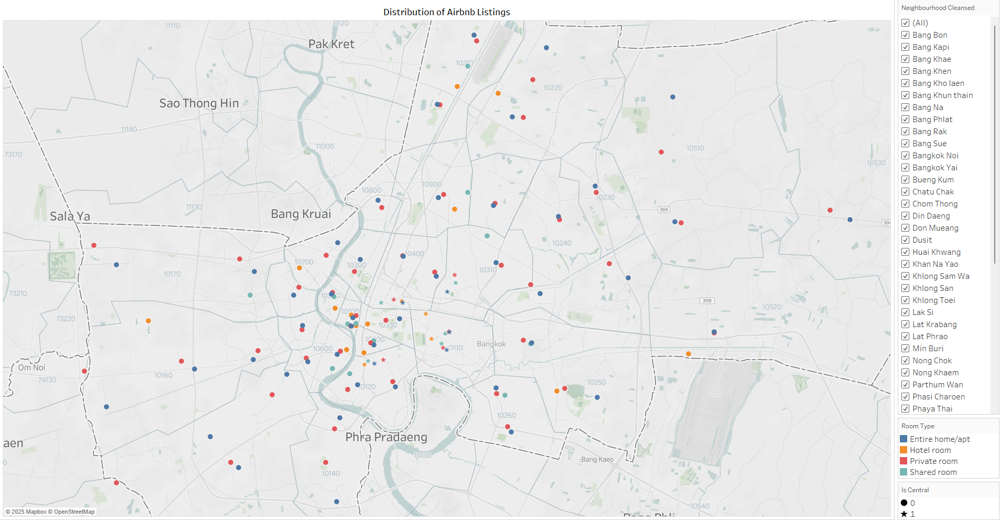

# 🏠 Airbnb Bangkok Data Platform   (วิเคราะห์ ทำความเข้าใจ และวางกลยุทธ์ราคาที่พักในกรุงเทพฯ)

This project is an end-to-end data analysis project exploring the dynamics and impacts of short-term rental listings on Airbnb in Bangkok, Thailand. This project aims to deliver actionable insights through data visualizations and in-depth analysis to support stakeholders in decision-making.

## 🔗 Project Resources

- 📄 [Project Canvas](https://www.canva.com/design/DAGmXjOI3l0/ziHAPmuQZ_6Li6dkWGW9RQ/edit?utm_content=DAGmXjOI3l0&utm_campaign=designshare&utm_medium=link2&utm_source=sharebutton)
- 🧮 [Data Preparation Notebook (Colab)](https://colab.research.google.com/drive/1-02Nbqbo4TElalLMlemI1xjEYGpQB7U3?usp=sharing)
- 📊 [Tableau Public Dashboard](https://your-tableau-link-here)
- 🎥 [Video Presentation](https://your-youtube-link-here)

## 📌 Project Objectives

- Analyze how room types, location, and rental styles affect listing prices.
- Evaluate spatial distribution of listings to understand demand and supply across Bangkok.
- Assess the potential impact of Entire Homes and Long-term Listings on local housing availability.
- Use price, review scores, and listing types to recommend sustainable pricing strategies.
  
## 📂 Project Structure

## 📊 Tools & Technologies

- **Data**: `listings.csv` from Inside Airbnb  
- **Languages**: Python (pandas, matplotlib)  
- **Platforms**: Google Colab, Tableau Public, GitHub  
- **Visualization**: Tableau Interactive Dashboard
  
## 🧭 Exploratory Data Analysis (EDA)

In this section, we explore key patterns in Bangkok's Airbnb market using data visualizations and interactive dashboards. Each analysis is designed to support business insights and strategic decisions.

---

### 🗺️ Sheet 1 – Bangkok Listing Density

A map showing the geographic distribution of Airbnb listings across Bangkok using real latitude and longitude coordinates.

- **Dot color** indicates room type:  
  🟦 Entire Home · 🟧 Hotel Room · 🟩 Private Room · 🟥 Shared Room  
- ⭐ Highlights central districts such as: Watthana, Khlong Toei, Huai Khwang, Ratchathewi, and Sathon.
- Reveals clustering patterns of different room types in specific areas.

**💡 Strategic Recommendations:**

- Adjust pricing strategy by room type and location.  
  In high-competition areas (e.g., Watthana), consider flexible pricing or value-added services like amenities or concierge offerings.
- Promote decentralization of listings into outer districts.  
  Support new hosts in non-central areas by:
  - Highlighting local attractions.
  - Offering marketing incentives or commission bonuses.

---

### ⭐ Sheet 2 – Listing Ratings by Category

A bar chart showing the number of Airbnb listings by review score group:

- Grouped into 5 buckets:  
  🟢 4.5+ · 🟡 4.0–4.49 · 🟠 3.5–3.99 · 🔴 3.0–3.49 · ⚪ No Rating
- Filters available by district to explore localized review trends.
- Visualizes guest satisfaction levels across Bangkok neighborhoods.

**Insight:**  
Over **70%** of all listings received **4.5+ ratings**, indicating high overall satisfaction.  
However, **5,000+ listings** have **no reviews**, which may indicate new or inactive listings.

**💡 Strategic Recommendations:**

- Encourage guests to leave reviews:  
  - Use reminders or offer next-booking discounts in exchange for feedback.
  - Higher review counts boost visibility and trust.
- Help new listings get their first review quickly:
  - Launch a "New Listing Campaign" with special pricing or guest incentives.
  - Improve discoverability and competitiveness for first-time hosts.

---

🔜 _More sheets and insights coming soon..._
